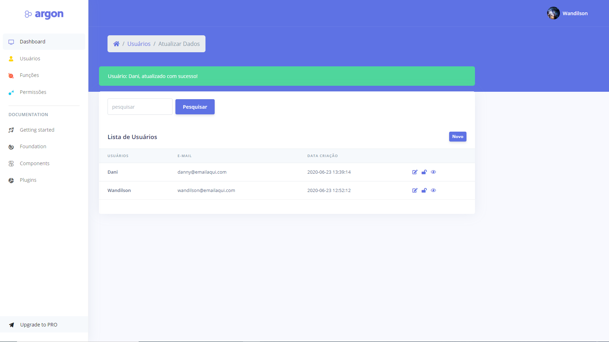

# Introdução
Start desenvolvido em Laravel7 e Blade.
Sua finalidade é agilizar o start de uma aplicação que tenha autenticação juntamente com autorização ACL.

## Recursos
- [x] Laravel 7
- [x] laravel-pt-BR-localization "https://github.com/lucascudo/laravel-pt-BR-localization"
- [x] laravel Socialite "Facebook/Google/Github"
- [x] Front-end Free "https://www.creative-tim.com/product/argon-dashboard-laravel"

## Módulos
- [X] Login Social/Login e Senha
- [X] Gerenciamento de perfil
- [X] Gerenciamento de Usuário
- [X] Gerenciamento de Acl Roles/Permissions
- [ ] Envio de e-mail ao ser cadastrado

## Screenshot

